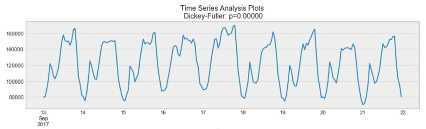
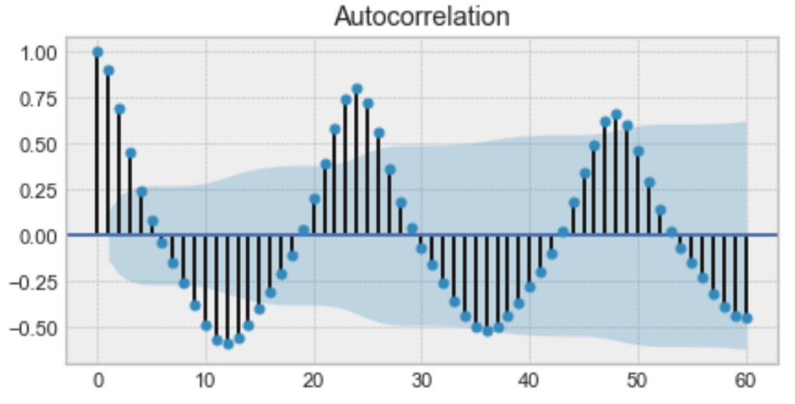

# MOwNiT & C++ Project

## Topic: Time Series Analysis

### C++ used for:

- web scraping
- preparing the data
- choosing the data to process

### Python used for:

- analysing time series
- predicting the data trends

## The theory behind time series analysis

### What is it?

A time series is simply a series of data points ordered in time. In a time series, time is often the independent
variable.

### What is the goal?

Time series are used in both forecasting the future and analysing the past in order to show recurring patterns.

### Aspects we need to get right in order to start:

**Stationarity** - an important characteristic of time series. A time series is said to be stationary if its statistical
properties do not change over time.

In other words, it has constant mean and variance, and covariance is independent of time.

Looking again at the same plot, we see that the process above is stationary. The mean and variance do not vary over
time.

**Seasonality** - refers to periodic fluctuations. For example, electricity consumption is high during the day and low
during night, or online sales increase during Christmas before slowing down again.

As you can see above, there is a clear daily seasonality. Every day, you see a peak towards the evening, and the lowest
points are the beginning and the end of each day.

**Autocorrelation** - the similarity between observations as a function of the time lag between them.

Above is an example of an autocorrelation plot. Looking closely, you realize that the first value and the 24th value
have a high autocorrelation. Similarly, the 12th and 36th observations are highly correlated. This means that we will
find a very similar value at every 24 unit of time.

## Where do we start?

We will start with the analysis found on the web and then move towards analysing ANY data found using our own **web
scraping api**

- Sample project is placed in *sample_project* directory :)
- Main project is in the *src* directory
